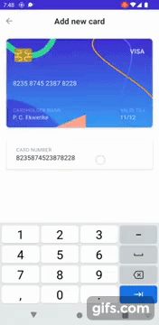

# CryptoWalletTemplate
A crypto currency wallet UI/UX template created using Android's jetpack compose.

## High definition demo on youtube
[Youtube video demo](https://youtu.be/9YgSU6bqmWw)

## 🎥 Low definition screen recordings
       

## Screenshots 
      
   
   

## Apk 
Download the app apk file [here](https://github.com/Pekwerike/CryptoWalletTemplate/raw/master/app-debug.apk)

## Credit
This project was inspired by a UI/UX video created by Nasir Uddin on [dribble](https://dribbble.com/shots/16764349-Crypto-Wallet-Add-New-Card)

>Yep, there is a lot of not so "neat code" in this repository as the purpose of this project is not targeted towards clean code.

